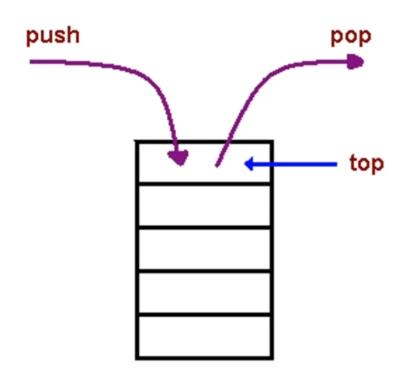

## 什么是栈？

一种`后进先出`的数据结构

JavaScript中没有栈，但可以用Array实现栈的所有功能。



## Coding Part

```javascript
const stack = []

stack.push(1) 1

stack.push(2) 1 2

const item1 = stack.pop() 1

const item2 = stack.pop() 2
```

## 栈的应用场景

**需要后进先出的场景**

**比如：**

1. **十进制转二进制**
2. **判断字符串的括号是否有效**
3. **函数调用堆栈**

###  **十进制转二进制**


###  **判断字符串的括号是否有效**（有效的括号）


###  函数调用堆栈


