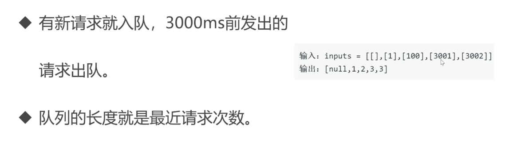

##  什么是队列

一种先进先出的数据结构

```javascript
const queue = []
queue.push(1)
queue.push(2)
queue.push(3)
const item1 = queue.shift() 1
const item2 = queue.shift() 2
```

##  队列的场景

需要先进先出的场景

- 食堂排队打饭
- js异步中的任务队列
- 计算最近请求次数

